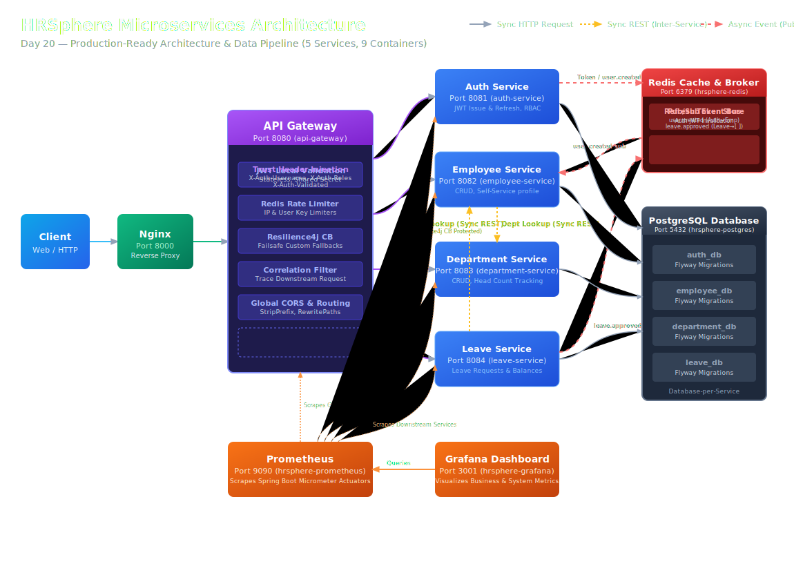

# HRSphere — AI-Powered HR Management System

HRSphere is a production-ready, enterprise-grade Human Resource Management System built using a **Java + Spring Boot microservices architecture**. Rather than a basic CRUD-over-REST application, HRSphere demonstrates how to build resilient, secure, and event-driven distributed systems. The project is designed around a database-per-service model, securing endpoints with gateway-level JWT token verification, implementing rate limiting and circuit breakers, executing message-driven workflows over Redis Pub/Sub, and monitoring the entire ecosystem with a Prometheus and Grafana observability pipeline.

---

## Architecture

The system is organized into a clean multi-tier microservices architecture consisting of **5 services** and **9 containers** in total.



### Request Flow
1. **Ingress:** All client requests hit the **Nginx Reverse Proxy** on port `8000`.
2. **Gateway:** Traffic is forwarded to the **API Gateway** on port `8080`, which checks rate limits (Redis-backed) and validates the JWT signature statelessly.
3. **Routing:** If valid, the Gateway injects user identity and roles as trusted downstream headers (`X-Auth-Username`, `X-Auth-Roles`) and routes the request to the target domain microservice.
4. **Data Isolation:** Domain services query their own isolated databases in PostgreSQL and communicate asynchronously via the Redis Pub/Sub event bus or synchronously via Resilience4j-wrapped REST calls.

---

## Services

| Service | Port | Responsibility | Database |
| :--- | :--- | :--- | :--- |
| **api-gateway** | `8080` | Ingress security, local JWT validation, rate limiting, Resilience4j circuit breakers, correlation ID trace propagation, global CORS. | None |
| **auth-service** | `8081` | User registration, authentication, token issue, Redis-backed refresh token invalidation, RBAC management. | `auth_db` |
| **employee-service** | `8082` | Full employee lifecycle CRUD, employee search lookups, self-service contact updates, department constraints. | `employee_db` |
| **department-service** | `8083` | Department management CRUD, manager assignment, and head count statistics. | `department_db` |
| **leave-service** | `8084` | Stateful leave application approval workflow, automated balance tracking, overlap validation. | `leave_db` |

---

## Key Engineering Decisions

The project's design is driven by formal architectural trade-offs. Each decision is documented in [docs/architecture-decisions.md](file:///home/rengoku_07/HRSPHERE/docs/architecture-decisions.md):

* **Database-per-Service (ADR-002 & ADR-004):** To ensure domain boundary integrity and independent deployability, services share a Postgres instance but connect to isolated databases (`auth_db`, `employee_db`, etc.) with independent credentials. Schema migrations are managed code-side via versioned **Flyway** migrations.
* **Gateway JWT Verification & Trust Headers (ADR-005):** The API Gateway validates tokens statelessly using a shared secret, eliminating synchronous network hops to `auth-service` for every incoming request. Valid requests are decorated with trusted headers (`X-Auth-Username`, `X-Auth-Roles`) which downstream services consume without re-verifying.
* **Resilient Inter-Service Communications:** Inter-service REST dependencies are wrapped with **Resilience4j Circuit Breakers**. We split resilience handling by dependency nature:
  * *Soft Dependencies* (e.g., validating a department during employee creation) degrade gracefully by logging a warning and proceeding.
  * *Hard Dependencies* (e.g., looking up an employee during leave requests) trigger a circuit breaker fallback returning a structured `503 Service Unavailable` response.
* **Event-Driven Decoupling:** Services leverage **Redis Pub/Sub** for async event propagation (e.g., publishing `user.created` to provision an employee profile, or `leave.approved` for payroll/notifiers), incorporating idempotent consumption to prevent duplicate processing.

---

## Tech Stack

* **Core Framework:** Java 17, Spring Boot 3.2.x, Spring Cloud Gateway, Spring Security
* **Data Stores:** PostgreSQL 16 (Relational DB), Redis 7 (Caching, Token Invalidation, Rate Limiting, Pub/Sub Event Broker)
* **Migrations:** Flyway Database Migrations
* **Resilience:** Resilience4j (Gateway and Service-level Circuit Breakers, Rate Limiters)
* **Testing Suite:** JUnit 5, Mockito, Testcontainers (Postgres/Redis), WireMock (mocking downstream timeouts/outages), Awaitility (asynchronous event verification)
* **Observability:** Spring Boot Actuator, Micrometer Prometheus Registry, Prometheus (Metrics Scraper), Grafana (Custom Dashboard Visualization)
* **Ingress:** Nginx

---

## Running the Project

### 1. Prerequisites
Ensure you have the following installed on your machine:
* Docker and Docker Compose
* Java 17 & Maven (or use the included `./mvnw`)

### 2. Environment Setup
Clone the repository and copy the environment template:
```bash
cp .env.example .env
```
*(Open `.env` and verify the passwords/ports. The default values are fully configured for local development).*

### 3. Spin Up Infrastructure & Services
Build and start all 9 containers in the background:
```bash
docker compose up -d --build
```
Verify that all containers are healthy:
```bash
docker compose ps
```

### 4. Database Provisioning
Run the provisioning script to create the database schemas:
```bash
./infra/postgres/apply-databases.sh
```
*Note: Each service will automatically run its Flyway migrations to create tables on startup once its database exists.*

### 5. Quick Smoke Test
Verify the gateway is routing traffic by registering a new user:
```bash
curl -X POST http://localhost:8000/api/v1/auth/register \
  -H "Content-Type: application/json" \
  -d '{"username":"dev_admin","email":"dev_admin@hrsphere.com","password":"AdminPassword123!","role":"ROLE_ADMIN"}'
```

---

## Testing

HRSphere maintains a comprehensive test suite utilizing **Testcontainers** to boot up real Postgres and Redis instances, and **WireMock** to simulate inter-service communication and outages.

* **Total Test Cases:** `117`
* **Test Files:** `34`
* **Run the tests:**
  ```bash
  ./mvnw clean install
  ```
*Note: Testcontainers will automatically skip if a Docker daemon is not running on the host machine, preventing broken local builds.*

---

## Observability

The project features a complete metrics collection and monitoring pipeline:
* **Prometheus Dashboard:** Access at [http://localhost:9090](http://localhost:9090) to inspect scraped Spring Boot Actuator metrics.
* **Grafana Dashboard:** Access at [http://localhost:3001](http://localhost:3001) (Credentials: `admin` / `admin`).
* The system is pre-configured to auto-provision the **HRSphere Overview Dashboard**, visualizing JVM stats, request latencies, rate limit occurrences, circuit breaker states, and custom business metrics (e.g., active employee count, leave applications/approvals).

---

## API Documentation & Postman

### Swagger UI
Downstream APIs auto-generate OpenAPI specifications which are exposed through the API Gateway:
* **Auth Service Docs:** [http://localhost:8000/api/v1/auth/swagger-ui/index.html](http://localhost:8000/api/v1/auth/swagger-ui/index.html)
* **Employee Service Docs:** [http://localhost:8000/api/v1/employees/swagger-ui/index.html](http://localhost:8000/api/v1/employees/swagger-ui/index.html)
* **Department Service Docs:** [http://localhost:8000/api/v1/department/swagger-ui/index.html](http://localhost:8000/api/v1/department/swagger-ui/index.html)
* **Leave Service Docs:** [http://localhost:8000/api/v1/leave/swagger-ui/index.html](http://localhost:8000/api/v1/leave/swagger-ui/index.html)

### Postman Collection
A pre-configured Postman Collection containing all **34 endpoints** is available in the `postman/` directory:
1. Import [postman/HRSphere.postman_collection.json](file:///home/rengoku_07/HRSPHERE/postman/HRSphere.postman_collection.json) and [postman/HRSphere.postman_environment.json](file:///home/rengoku_07/HRSPHERE/postman/HRSphere.postman_environment.json) into Postman.
2. Select the `HRSphere Dev` environment.
3. Run the **Login** request inside `Auth Service` (uses seeded developer credentials: `admin` / `Admin123!`).
4. The test script will automatically capture the returned `accessToken` and update your environment variables so all subsequent requests authenticate seamlessly.

---

## Project Structure

```text
hrsphere/
├── api-gateway/          # Spring Cloud Gateway (circuit breakers, rate limits, correlation ID)
├── auth-service/         # JWT issuing, refresh token cache, RBAC stats
├── department-service/   # Department CRUD and manager configurations
├── employee-service/     # Employee CRUD, lookup mappings, self-service updates
├── leave-service/        # Leave application workflows, balance allocations
├── common/               # Shared DTOs, custom exception handlers, validation utilities
├── nginx/                # Reverse proxy configuration
├── infra/                # Core infrastructure configs
│   ├── postgres/         # Logical database provisioning SQL scripts
│   ├── prometheus/       # Scrape targets YAML config
│   └── grafana/          # Auto-provisioned dashboards & datasources
├── docs/                 # Architecture Decision Records (ADRs) & interview prep
├── postman/              # Postman collection & environment configuration files
├── pom.xml               # Root parent pom.xml coordinates
└── docker-compose.yml    # Orchestrates the 9 container stack
```

---

## What's Not Included (Honest Scope Boundary)

To maintain focus and deliver high-depth quality within a reduced development timeline, the following features were intentionally excluded from this release (see [docs/architecture-decisions.md](file:///home/rengoku_07/HRSPHERE/docs/architecture-decisions.md) for rationale):

* **Kafka Distributed Broker:** We opted for Redis Pub/Sub for messaging. While Redis does not support consumer offsets, consumer groups, or message persistence, it eliminated the infrastructure footprint of Zookeeper/Kafka and allowed us to focus on idempotent consumer patterns locally.
* **Kubernetes Orchestration:** We selected Docker Compose to simplify local builds and testing. K8s deployment manifests and service meshes were deferred as they represent deployment-level concerns rather than application-layer architecture.
* **Centralized Logging & Distributed Tracing:** We implemented correlation ID filters to inject tracing IDs into logs. Full log aggregation (e.g., ELK/Loki) and Zipkin/Jaeger tracing collectors were deferred due to memory overhead and setup time.
* **Additional Services (Workforce, AI, Notifications, Payroll):** Aspirational microservices from early design phases were omitted. We prioritized hardening the core domain services (Auth, Employee, Department, Leave) rather than building shallow, incomplete interfaces for other areas.
