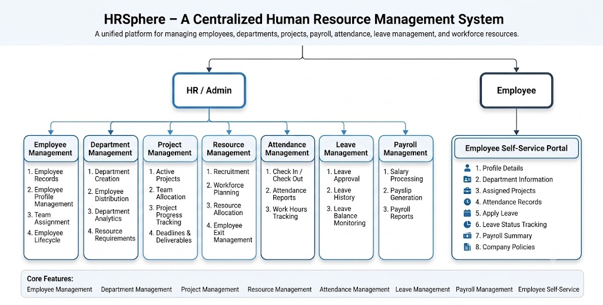

# HRSphere

A centralized Human Resource Management System (HRMS) designed to streamline workforce operations, employee management, attendance tracking, payroll processing, leave management, and organizational resource planning.

---

## Overview

HRSphere aims to provide a unified platform for managing core HR activities within an organization. The system enables HR administrators to efficiently manage employees, departments, projects, workforce allocation, attendance, payroll, and leave requests while providing employees with a self-service portal to access their personal and work-related information.

The platform focuses on reducing manual administrative effort, improving workforce visibility, and enhancing operational efficiency through a centralized management system.

---

## System Overview

The system serves two primary stakeholders:

### HR / Admin

The HR/Admin module provides complete control over workforce and organizational operations.

Responsibilities include:

* Employee Management
* Department Management
* Project Management
* Workforce Management
* Attendance Management
* Leave Management
* Payroll Management

### Employee

The Employee module provides a self-service portal that enables employees to access and manage their work-related information.

Employees can:

* View Profile Information
* Access Department Details
* View Assigned Projects
* Monitor Attendance Records
* Apply for Leave
* Track Leave Status
* View Payroll Information
* Access Company Policies

---

## Core Modules

### Employee Management

* Employee Records
* Profile Management
* Team Assignment
* Employee Lifecycle Management

### Department Management

* Department Creation
* Employee Distribution
* Department Insights
* Resource Requirements

### Project Management

* Active Projects
* Team Allocation
* Project Progress Tracking
* Deliverables and Deadlines

### Workforce Management

* Recruitment
* Workforce Planning
* Resource Allocation
* Employee Exit Management

### Attendance Management

* Check In / Check Out
* Attendance Reports
* Work Hours Tracking

### Leave Management

* Leave Applications
* Leave Approval Workflow
* Leave History
* Leave Balance Monitoring

### Payroll Management

* Salary Processing
* Payslip Generation
* Payroll Records
* Payroll Analytics

### Employee Self-Service Portal

* Personal Information
* Department Information
* Project Information
* Attendance Records
* Leave Requests
* Payroll Summary
* Company Policies

---

## System Overview Diagram



---

## Planned Architecture

```text
Client Application
        │
        ▼
Spring Security + JWT
        │
        ▼
REST Controllers
        │
        ▼
Service Layer
        │
        ▼
Repository Layer
        │
        ▼
PostgreSQL Database
```

---

## Planned Tech Stack

### Backend

* Java 21
* Spring Boot
* Spring Security
* Spring Data JPA
* Hibernate
* JWT Authentication

### Database

* PostgreSQL

### Documentation

* Swagger / OpenAPI

### Build Tool

* Maven

### Version Control

* Git & GitHub

---

## Project Status

🚧 Currently in Planning & Design Phase

Completed:

* Project Scope Definition
* System Overview Design

In Progress:

* ER Diagram
* Database Design
* Architecture Design

Upcoming:

* Spring Boot Project Setup
* Authentication & Authorization
* Employee Management Module

---

## Future Enhancements

* Email Notifications
* Audit Logging
* Dashboard Analytics
* Report Generation
* Export to PDF/Excel
* Role-Based Access Control Enhancements

---

## Author

Hitesh L

Built as a backend-focused enterprise application using Java and Spring Boot.
